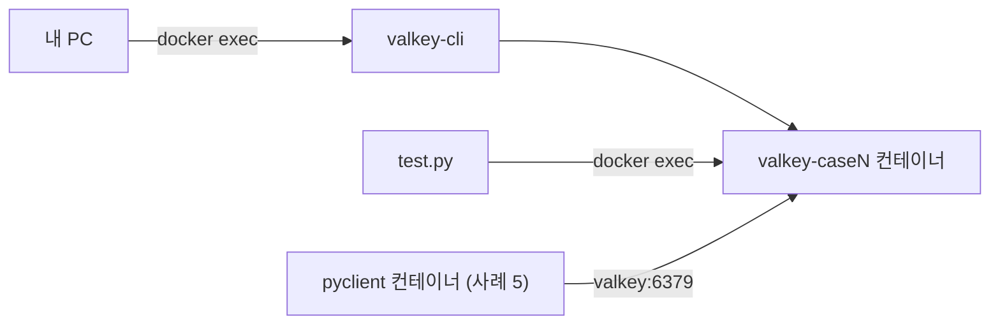
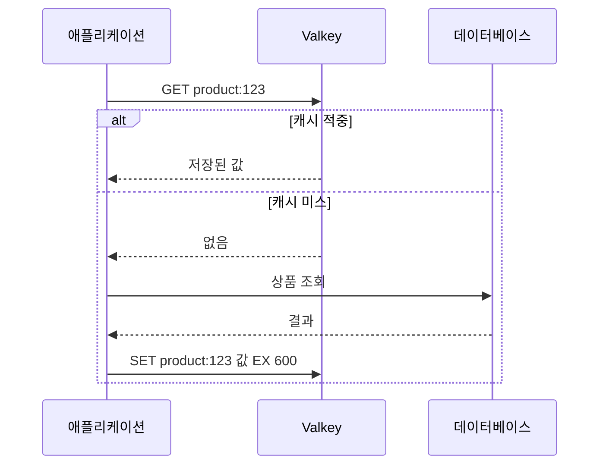
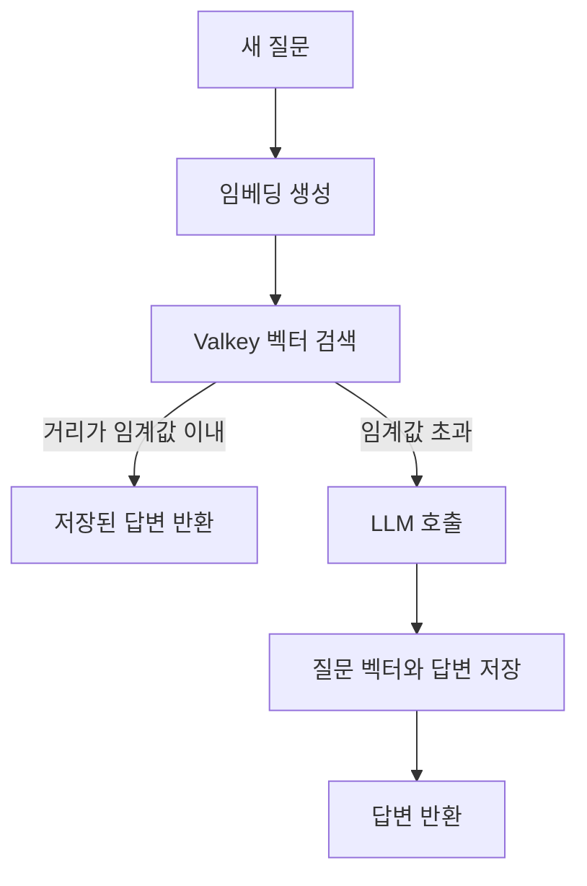
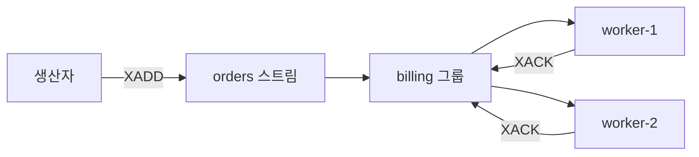
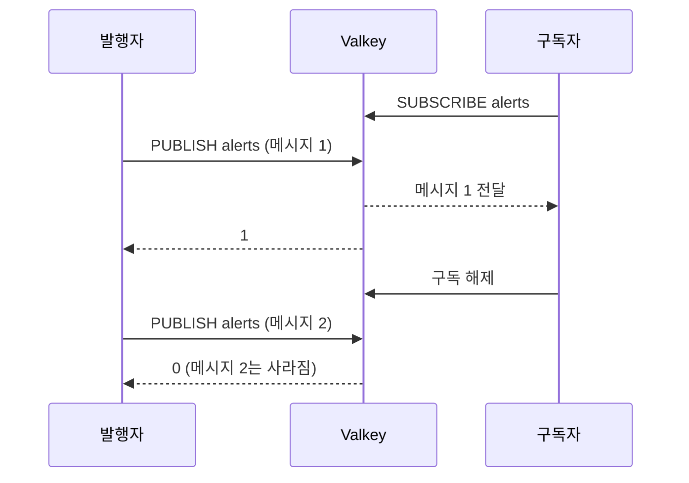

# Valkey 활용 사례 8가지

> **이 장의 목표**
> - Valkey를 캐시를 넘어 여덟 가지 용도로 활용하는 방법을 이해합니다.
> - 각 사례를 로컬 Docker 환경에서 직접 실행하고, 자동화된 검증 코드로 결과를 확인합니다.
> - 사례마다 적합한 기능과 한계를 구분하는 기준을 세웁니다.

## 들어가며

Valkey는 오픈소스 인메모리 데이터 저장소입니다. 많은 팀이 Valkey를 캐시로만 사용합니다. 하지만 Valkey는 문자열, 해시, 정렬된 셋, 스트림 같은 자료구조를 제공합니다. 이 자료구조를 이해하면 별도 서비스를 추가하기 전에 해결할 수 있는 문제가 많습니다.

이 장은 여덟 가지 사례를 다룹니다. 모든 사례는 같은 순서로 구성합니다.

1. 풀려는 문제를 설명합니다.
2. 문제를 푸는 Valkey 기능을 설명합니다.
3. Docker에서 명령을 직접 실행하고 결과를 확인합니다.
4. 검증 코드가 무엇을 확인하는지 정리합니다.
5. 운영에서 주의할 점을 짚습니다.

### Valkey와 Redis의 관계

Valkey는 Redis OSS의 벤더 중립적 오픈소스 후속 프로젝트입니다. Redis OSS 7.2와 그 이전 버전의 프로토콜, 설정, 데이터 파일 형식과 호환됩니다. 기존 Redis 클라이언트 라이브러리도 대부분 코드 수정 없이 연결할 수 있습니다 [1].

> **주의**
> Redis Community Edition 7.4 이상이 만든 데이터 파일은 Valkey와 호환되지 않습니다 [1]. 이 버전에서 이전하려면 데이터 파일을 복사하는 방식 대신 다른 방법을 검토해야 합니다.

> **참고**
> 호환성을 위해 Valkey는 `INFO` 출력에 `redis_version:7.2.4`를 표시합니다 [1]. 실제 Valkey 버전은 `valkey_version` 항목으로 확인합니다.

### 사례 한눈에 보기

**표 1** 사례별 핵심 기능과 실습 방식

| 번호 | 사례 | 핵심 기능 | 실습 방식 |
| --- | --- | --- | --- |
| 1 | 캐싱 | `SET ... EX`, 메모리 제거 정책 | `valkey-cli` |
| 2 | 세션 저장소 | 해시, `EXPIRE` | `valkey-cli` |
| 3 | 레이트 리미팅 | `INCR`, Lua 스크립트, 정렬된 셋 | `valkey-cli` |
| 4 | 실시간 리더보드 | 정렬된 셋 | `valkey-cli` |
| 5 | 벡터 검색과 시맨틱 캐싱 | Valkey-Search 모듈 | Python 스크립트 |
| 6 | 큐와 스트림 | 스트림, 컨슈머 그룹 | `valkey-cli` |
| 7 | Pub/Sub | `SUBSCRIBE`, `PUBLISH` | 터미널 2개 |
| 8 | 분산 락 | `SET ... NX PX`, Lua 스크립트 | `valkey-cli` |

---

## 실습 환경 준비

### 사전 준비

- Docker Desktop 또는 Docker Engine
- Docker Compose v2 (`docker compose` 명령)
- Python 3.10 이상 (검증 코드 실행용)

### 폴더 구성

사례마다 독립된 폴더를 사용합니다. 폴더끼리 컨테이너 이름과 네트워크가 겹치지 않으므로, 한 사례를 끝내지 않고 다른 사례를 실행해도 됩니다.

```text
valkey_lab/
├─ verify_all.py        # 전체 사례 일괄 검증
├─ case_1/ ... case_8/
│  ├─ compose.yaml      # Valkey 컨테이너 정의
│  ├─ test.py           # 검증 코드 (사례 5는 vector_demo.py)
│  └─ README.md
```

### Compose 구성

모든 사례가 같은 형태의 `compose.yaml`을 사용합니다. 아래는 사례 1의 예입니다.

```yaml
services:
  valkey:
    image: valkey/valkey-bundle:latest
    container_name: valkey-case1
    healthcheck:
      test: ["CMD", "valkey-cli", "ping"]
      interval: 2s
      timeout: 3s
      retries: 15
```

`valkey-bundle` 이미지는 Valkey 서버와 함께 검색(Valkey-Search)과 JSON 모듈을 포함합니다. 사례 5에서 검색 모듈이 필요하므로 모든 사례에 같은 이미지를 사용합니다. 헬스체크는 서버가 응답할 때까지 기다리는 용도입니다.

> **참고**
> 컨테이너 포트를 호스트에 공개하지 않습니다. 모든 명령은 `docker exec`로 컨테이너 안에서 실행하므로 호스트의 6379 포트와 충돌하지 않습니다.

### 실행 순서

사례 폴더로 이동해 서버를 띄우고, 명령을 직접 입력하거나 검증 코드를 실행합니다.

```bash
cd case_1
docker compose up -d --wait
docker exec -it valkey-case1 valkey-cli     # 직접 실습
python test.py                              # 자동 검증
docker compose down -v
```

접속 후 `PING`을 입력해 `PONG`이 반환되는지 확인합니다.

### 검증 방식

검증 코드는 명령을 실행하고 결과를 출력하는 데서 끝나지 않습니다. 기대하는 결과를 단언(assert)으로 정의하고, 통과하면 `PASS`, 어긋나면 `FAIL`을 출력합니다. 하나라도 실패하면 종료 코드 1을 반환합니다. 전체 사례는 다음 명령으로 한 번에 검증합니다.

```bash
python verify_all.py
```

이 장의 출력 예시는 모두 이 검증 코드가 실제 컨테이너에서 낸 결과입니다.

**표 2** 출력 예시를 수집한 환경

| 항목 | 값 |
| --- | --- |
| 이미지 | `valkey/valkey-bundle:latest` |
| Valkey 버전 | 9.1.2 |
| 수집일 | 2026년 10월 3일 |
| 로드된 모듈 | search, json, bf, ldap |

> **주의**
> `latest` 태그는 시간이 지나면 다른 버전을 가리킵니다. 독자의 환경에서 `TTL`이나 `PTTL` 같은 시간 값은 1~2초, 메시지 ID는 실행 시각에 따라 다르게 나옵니다. 값 자체가 아니라 형식과 증감 방향을 비교하십시오.

**그림 1** 실습 환경의 구성



---

## 사례 1. 캐싱

### 문제

데이터베이스 조회와 외부 API 호출은 느리고 비용이 큽니다. 같은 결과를 반복해서 요청하면 지연 시간과 부하가 함께 늘어납니다.

### 해법

자주 읽는 결과를 Valkey에 저장하고, 저장할 때 만료 시간(TTL)을 지정합니다. 오래된 데이터가 자동으로 사라집니다.

애플리케이션은 보통 그림 2의 순서로 동작합니다. 이를 캐시 어사이드(cache-aside) 패턴이라고 합니다.

**그림 2** 캐시 어사이드 패턴의 요청 흐름



### 실습 A. 적중과 미스

통계를 초기화한 뒤, 미스와 적중을 한 번씩 만듭니다.

```text
CONFIG RESETSTAT
GET product:123
SET product:123 "{\"name\":\"keyboard\",\"price\":59000}" EX 600
GET product:123
TTL product:123
INFO stats
```

**실행 결과**

```text
(nil)
OK
"{\"name\":\"keyboard\",\"price\":59000}"
(integer) 599
keyspace_hits:1
keyspace_misses:1
```

처음 `GET`은 값이 없어 미스로 집계됩니다. 저장 뒤 `GET`은 적중입니다. `INFO stats`에서 `keyspace_hits`와 `keyspace_misses`를 보면 캐시의 효과를 수치로 확인할 수 있습니다. 상품이 바뀌면 키를 삭제합니다.

```text
DEL product:123
```

### 실습 B. 메모리 한도와 키 제거

메모리가 가득 찼을 때의 동작을 확인합니다. 먼저 현재 사용량을 봅니다.

```text
INFO memory
```

**실행 결과(발췌)**

```text
used_memory:5527112
```

모듈이 포함된 빈 서버가 이미 약 5.5MB를 사용합니다. 한도를 이보다 낮게 잡으면 의미 있는 실습이 되지 않으므로, 여유를 두고 8MB로 설정합니다. 정책은 `allkeys-lru`입니다. 모든 키를 대상으로, 최근에 덜 쓰인 키를 먼저 제거합니다 [6].

```text
CONFIG SET maxmemory 8mb
CONFIG SET maxmemory-policy allkeys-lru
CONFIG GET maxmemory-policy
```

**실행 결과**

```text
OK
OK
1) "maxmemory-policy"
2) "allkeys-lru"
```

이제 1KB 값을 가진 키 8,000개(약 8MB)를 기록해 한도를 넘깁니다. 컨테이너에 포함된 `valkey-benchmark`를 사용합니다.

```bash
docker exec valkey-case1 valkey-benchmark -t set -n 8000 -d 1024 -r 8000 -q
```

```text
INFO stats
DBSIZE
```

**실행 결과(발췌)**

```text
evicted_keys:4994
(integer) 1587
```

8,000번 기록했지만 남은 키는 1,587개이고, 4,994개가 제거되었습니다. 같은 키가 겹쳐 쓰인 경우가 있어 두 수의 합이 8,000과 정확히 같지는 않습니다.

> **참고**
> Valkey의 LRU는 근사 알고리즘입니다 [6]. 정확히 가장 오래된 키가 아니라, 무작위 표본에서 가장 오래된 키를 제거합니다. 제거 대상을 엄밀하게 예측하는 코드는 작성하지 마십시오.

### 검증 항목

**표 3** 사례 1의 검증 항목

| 시나리오 | 기대 결과 |
| --- | --- |
| 저장 전 `GET` | `(nil)` |
| 저장 후 `GET` | 저장한 값 |
| 통계 초기화 후 `GET` 두 번 | `keyspace_hits:1`, `keyspace_misses:1` |
| `TTL` | 590~600초 |
| 기준 `used_memory` | 2MB 초과 (2MB 제한이 부적합함을 확인) |
| 8MB 한도에 8,000건 기록 | `evicted_keys > 0`, 남은 키 < 8,000, 사용량이 한도 부근 유지 |

### 운영 시 주의점

> **주의**
> 캐시는 원본이 아닙니다. 캐시가 사라져도 서비스가 동작하도록 설계해야 합니다.

- TTL이 없는 캐시 키는 메모리를 계속 차지합니다.
- 인기 키가 동시에 만료되면 데이터베이스에 요청이 몰릴 수 있습니다. 만료 시각에 약간의 무작위 값을 더해 분산하는 방법을 검토하십시오.
- 제거 정책은 서비스의 접근 패턴에 맞춰 고릅니다. 소수의 키에 요청이 몰린다면 `allkeys-lru`가 무난합니다 [6].

---

## 사례 2. 세션 저장소

### 문제

서버가 세션을 자기 메모리에 저장하면 사용자가 다른 서버로 접속할 때 로그인이 풀립니다. 서버를 늘리거나 배포할 때도 세션이 사라집니다.

### 해법

세션을 Valkey에 모읍니다. 모든 애플리케이션 서버가 같은 저장소를 읽으므로 서버는 상태를 갖지 않아도 됩니다. 이를 **무상태(stateless)** 구조라고 합니다.

세션 하나는 해시 하나로 표현하면 편합니다. 필드 단위로 읽고 수정할 수 있기 때문입니다.

### 실습

세션을 만들고 30분 만료를 지정합니다.

```text
HSET session:8f2a user_id 42 role user cart_id c-1001
EXPIRE session:8f2a 1800
HGETALL session:8f2a
TTL session:8f2a
```

**실행 결과**

```text
(integer) 3
(integer) 1
1) "user_id"
2) "42"
3) "role"
4) "user"
5) "cart_id"
6) "c-1001"
(integer) 1800
```

사용자가 활동하면 `EXPIRE`를 다시 호출해 만료 시간을 늘립니다. 2초가 지난 뒤 `TTL`은 1797이었고, `EXPIRE`를 다시 실행하자 1800으로 돌아왔습니다.

필드 하나만 바꿀 수도 있습니다. 이때 TTL은 유지됩니다.

```text
HSET session:8f2a role admin
HGET session:8f2a role
```

**실행 결과**

```text
(integer) 0
"admin"
```

`HSET`이 `0`을 반환한 것은 새 필드가 아니라 기존 필드의 값을 갱신했다는 뜻입니다. 로그아웃은 키를 삭제합니다.

```text
DEL session:8f2a
```

### 검증 항목

**표 4** 사례 2의 검증 항목

| 시나리오 | 기대 결과 |
| --- | --- |
| 필드 3개 저장 후 `HGETALL` | 세 필드 모두 조회 |
| `EXPIRE 1800` 직후 `TTL` | 1795~1800 |
| 2초 경과 후 `TTL` | 1798 이하로 감소 |
| `EXPIRE` 재호출 후 `TTL` | 1799 이상으로 복구 |
| 기존 필드 `HSET` | `0` 반환, 값 변경, TTL 유지 |
| TTL 2초 세션을 3초 뒤 조회 | `EXISTS`가 `0` |
| `DEL` 후 조회 | 세션 없음 |

### 운영 시 주의점

- 세션 식별자는 추측하기 어려운 값으로 생성해야 합니다.
- 세션에 민감한 정보를 넣지 마십시오. 필요한 최소 정보만 저장합니다.
- 세션 저장소가 중단되면 모든 사용자가 로그아웃됩니다. 가용성 요구에 따라 복제 구성을 검토하십시오.

---

## 사례 3. 레이트 리미팅

### 문제

특정 사용자나 IP가 API를 지나치게 호출하면 서비스 전체가 느려집니다. 로그인 무차별 대입 공격도 같은 방식으로 막아야 합니다.

### 해법

호출 횟수를 Valkey에서 세고, 한도를 넘으면 요청을 거절합니다. 서버가 여러 대여도 카운터가 한 곳에 있으므로 제한이 일관됩니다. 이 장은 두 가지 방식을 다룹니다.

**표 5** 레이트 리미팅 방식 비교

| 방식 | 구현 | 특징 |
| --- | --- | --- |
| 고정 윈도우 | `INCR` + `EXPIRE` | 구현이 단순합니다. 구간 경계에서 순간적으로 한도의 두 배까지 허용될 수 있습니다. |
| 슬라이딩 윈도우 | 정렬된 셋 | 한도를 정확히 지킵니다. 요청마다 기록을 저장하므로 메모리를 더 씁니다. |

### 실습 A. 고정 윈도우

1분에 5회까지 허용합니다. 카운터를 올리는 `INCR`과 만료를 지정하는 `EXPIRE`는 별개 명령입니다. 두 명령 사이에 장애가 나면 만료 시간이 없는 카운터가 남아 사용자가 영구히 차단될 수 있습니다. 그래서 Lua 스크립트로 묶어 한 번에 실행합니다.

```text
EVAL "local c = server.call('INCR', KEYS[1]) if c == 1 then server.call('EXPIRE', KEYS[1], ARGV[1]) end return c" 1 ratelimit:user:42:202610032100 60
```

이 명령을 7번 반복한 결과입니다. 한도는 5입니다.

**표 6** 고정 윈도우의 요청별 결과

| 요청 | 반환값 | 판정 |
| --- | --- | --- |
| 1 | 1 | 허용 |
| 2 | 2 | 허용 |
| 3 | 3 | 허용 |
| 4 | 4 | 허용 |
| 5 | 5 | 허용 |
| 6 | 6 | 거절 |
| 7 | 7 | 거절 |

카운터가 처음 1이 될 때만 만료를 지정합니다. 이후 호출은 만료 시간을 건드리지 않으므로, 윈도우가 1분 단위로 유지됩니다. `TTL`을 확인하면 `59`처럼 남은 시간이 나옵니다. 윈도우가 지나면 키가 사라지고 카운터는 `1`부터 다시 시작합니다.

### 실습 B. 슬라이딩 윈도우

요청 시각을 점수로 삼아 정렬된 셋에 저장합니다. 요청이 들어올 때마다 다음 순서로 처리합니다.

1. `ZREMRANGEBYSCORE`로 창 밖의 오래된 기록을 지웁니다.
2. `ZCARD`로 창 안의 요청 수를 셉니다.
3. 한도 미만이면 `ZADD`로 기록하고 허용합니다.

```text
ZREMRANGEBYSCORE sliding:user:42 -inf <현재시각 - 60>
ZCARD sliding:user:42
ZADD sliding:user:42 <현재시각> <요청ID>
```

창은 60초, 한도는 3회로 두고 시각을 초 단위 정수로 가정해 실행한 결과입니다.

**표 7** 슬라이딩 윈도우의 시각별 결과

| 시각(초) | 지워진 기록 | 창 안의 기존 건수 | 판정 |
| --- | --- | --- | --- |
| 100 | 0 | 0 | 허용 |
| 130 | 0 | 1 | 허용 |
| 155 | 0 | 2 | 허용 |
| 156 | 0 | 3 | 거절 |
| 170 | 1 | 2 | 허용 |
| 171 | 0 | 3 | 거절 |

170초에 주목하십시오. 시각 100의 요청이 창(110~170) 밖으로 밀려나 지워졌고, 그 덕분에 새 요청이 허용되었습니다. 고정 윈도우와 달리 창이 요청 시각을 따라 이동합니다.

### 검증 항목

**표 8** 사례 3의 검증 항목

| 시나리오 | 기대 결과 |
| --- | --- |
| 고정 윈도우 7회 호출 | 카운터 1~7, 5회까지 허용 |
| 카운터의 `TTL` | 1~60초 |
| 2초 윈도우를 3초 뒤 재호출 | 카운터가 1로 초기화 |
| 슬라이딩 윈도우 6회 요청 | 표 7과 동일한 허용/거절 |

### 운영 시 주의점

> **주의**
> 실습 B의 세 단계는 각각 별개 명령입니다. 여러 서버가 동시에 실행하면 두 요청이 같은 건수를 읽고 둘 다 허용되어 한도를 넘을 수 있습니다. 운영에서는 세 단계를 Lua 스크립트로 묶으십시오.

- 한도를 넘은 응답에는 재시도 가능 시간을 알려 주는 편이 좋습니다.
- 슬라이딩 윈도우는 요청 하나가 멤버 하나입니다. 한도가 크면 키가 커집니다.

---

## 사례 4. 실시간 리더보드와 랭킹

### 문제

게임 점수나 판매 실적처럼 값이 바뀔 때마다 순위를 다시 계산해야 합니다. 요청마다 SQL의 `ORDER BY`를 실행하면 부하가 커집니다.

### 해법

정렬된 셋(Sorted Set)을 사용합니다. 멤버마다 점수를 붙이면 Valkey가 점수 순서를 유지합니다. 공식 문서도 대규모 온라인 게임의 최고 점수 목록을 대표적인 활용으로 소개합니다 [7]. 점수를 올리면 순위도 즉시 바뀝니다.

### 실습

```text
ZADD leaderboard:weekly 120 alice 95 bob 150 carol
ZINCRBY leaderboard:weekly 100 bob
ZRANGE leaderboard:weekly 0 2 REV WITHSCORES
ZREVRANK leaderboard:weekly alice
ZSCORE leaderboard:weekly bob
```

**실행 결과**

```text
(integer) 3
"195"
1) "bob"
2) "195"
3) "carol"
4) "150"
5) "alice"
6) "120"
(integer) 2
"195"
```

**표 9** 사례 4의 명령과 역할

| 명령 | 역할 |
| --- | --- |
| `ZADD` | 멤버와 점수를 추가합니다. |
| `ZINCRBY` | 점수를 증가시키고 새 점수를 반환합니다. |
| `ZRANGE ... REV WITHSCORES` | 점수가 높은 순서로 상위 N명을 조회합니다. |
| `ZREVRANK` | 점수가 높은 순서에서 멤버의 순위를 반환합니다. 0부터 시작합니다. |
| `ZSCORE` | 멤버의 점수를 조회합니다. |

alice의 순위는 `2`입니다. 0부터 세므로 3위입니다. 화면에 표시할 때는 1을 더하십시오. 없는 멤버를 조회하면 `(nil)`이 반환됩니다.

alice에게 100점을 더하면 순위가 즉시 바뀝니다.

```text
ZINCRBY leaderboard:weekly 100 alice
ZREVRANK leaderboard:weekly alice
```

**실행 결과**

```text
"220"
(integer) 0
```

alice가 220점으로 1위가 되었습니다. 별도의 재계산 과정은 없습니다.

#### 동점 처리

점수가 같으면 멤버 이름을 사전순으로 정렬합니다 [7]. 같은 점수 100을 가진 `a`와 `b`를 넣고 조회한 결과입니다.

```text
ZRANGE leaderboard:tie 0 -1        ->  a, b
ZRANGE leaderboard:tie 0 -1 REV    ->  b, a
```

`REV`로 높은 순서를 조회하면 동점자의 순서도 뒤집힙니다. "먼저 달성한 사람이 앞선다" 같은 규칙이 필요하다면 점수에 시각 정보를 반영해야 합니다.

주간 순위처럼 기간이 끝나면 사라져야 한다면 키에 만료 시간을 지정합니다.

```text
EXPIRE leaderboard:weekly 604800
```

### 검증 항목

**표 10** 사례 4의 검증 항목

| 시나리오 | 기대 결과 |
| --- | --- |
| 점수 증가 후 상위 3명 조회 | bob(195), carol(150), alice(120) |
| `ZREVRANK alice` | `2` |
| 없는 멤버 `ZREVRANK` | `(nil)` |
| alice +100 후 순위 | `0` |
| 동점 멤버 조회 | 정방향 a, b / `REV` b, a |
| `EXPIRE 604800` | 성공, `TTL`이 7일 이내 |

### 운영 시 주의점

- 멤버 수가 매우 크면 키 하나가 커집니다. 기간이나 구간별로 키를 나누십시오.
- 사용자 목록 전체가 아니라 상위 N명 조회가 기본 사용 패턴입니다.

---

## 사례 5. 벡터 검색과 시맨틱 캐싱

### 문제

생성형 AI 응용은 의미가 비슷한 문서나 질문을 찾아야 합니다. 문자열이 같지 않아도 뜻이 가까우면 같은 결과로 취급해야 합니다.

### 해법

텍스트를 숫자 배열인 **임베딩 벡터**로 바꿔 저장하고, 가까운 벡터를 검색합니다. Valkey에서는 **Valkey-Search** 모듈이 이 기능을 제공합니다 [2].

Valkey-Search는 해시나 Valkey-JSON 데이터를 색인할 수 있습니다. 벡터 검색은 HNSW 기반 근사 최근접 이웃(ANN) 검색과 정확한 KNN 검색을 지원합니다 [2].

**시맨틱 캐싱**은 이 기능의 응용입니다. 새 질문이 이전 질문과 의미상 가깝다면, 이미 만든 답변을 다시 사용합니다. 값비싼 LLM 호출을 줄일 수 있습니다.

**그림 3** 시맨틱 캐시의 처리 흐름



### 실습 설계

실제 임베딩 모델 대신 4차원 예시 벡터를 사용합니다. 목적은 검색 흐름과 판정 방식을 확인하는 것입니다. 벡터 세 개를 두 사용자(테넌트)에게 나누어 저장합니다.

**표 11** 실습에 사용하는 데이터

| 키 | 테넌트 | 질문 | 벡터 |
| --- | --- | --- | --- |
| `qa:1` | userA | 이번 달 카드 사용 내역을 요약해줘 | (0.9, 0.1, 0.0, 0.1) |
| `qa:2` | userA | 내일 서울 날씨는? | (0.0, 0.1, 0.9, 0.2) |
| `qa:3` | userB | 이번 달 카드 사용 내역 알려줘 | (0.88, 0.12, 0.02, 0.1) |

### 인덱스 생성

`tenant`는 TAG 필드로, `embedding`은 HNSW 벡터 필드로 선언합니다. 거리 척도는 코사인입니다.

```text
FT.CREATE qa_idx ON HASH PREFIX 1 qa: SCHEMA
  tenant TAG
  embedding VECTOR HNSW 6 TYPE FLOAT32 DIM 4 DISTANCE_METRIC COSINE
```

벡터는 FLOAT32 값을 리틀 엔디언 바이트열로 직렬화해 해시 필드에 저장합니다. 텍스트 명령으로 입력하기 어려우므로 Python으로 실행합니다. 핵심 부분만 발췌합니다. 전체 코드는 `case_5/vector_demo.py`에 있습니다.

```python
def vec(*values):
    """FLOAT32 little-endian 바이트열로 변환합니다."""
    return struct.pack(f"<{len(values)}f", *values)

def search(query_vector, tenant=None):
    base = f"(@tenant:{{{tenant}}})" if tenant else "*"
    return r.execute_command(
        "FT.SEARCH", "qa_idx", f"{base}=>[KNN 1 @embedding $vec AS score]",
        "PARAMS", "2", "vec", query_vector,
        "RETURN", "2", "score", "answer",
    )
```

`(@tenant:{userA})=>[KNN 1 ...]`는 userA의 데이터로 후보를 먼저 좁힌 뒤 가장 가까운 1건을 찾는 구문입니다. 실행합니다.

```bash
cd case_5
docker compose up -d --wait
docker compose run --rm pyclient sh -c "pip install -q valkey && python vector_demo.py"
```

### 실행 결과

새 질문의 벡터는 (0.85, 0.15, 0.05, 0.1)입니다.

```text
검색 결과: {'key': 'qa:1', 'score': 0.00368486717343, 'answer': 'A 사용자의 카드 사용 요약'}
독립 계산한 코사인 거리: 0.003684867777
```

`qa:1`이 선택되었고, `score`는 0에 가깝습니다. 이 값은 코사인 거리입니다. 코드 안에서 `1 - (두 벡터의 내적 ÷ 두 벡터 길이의 곱)`을 직접 계산한 값(0.003684867777)과 서버의 값이 일치합니다. 서버 결과를 믿고 쓰기 전에 독립적으로 검산한 것입니다.

임계값을 0.1로 두면 이 결과는 캐시 적중입니다. 의미가 무관한 질문, 벡터 (0.1, 0.9, 0.1, 0.9)로 검색한 결과는 다음과 같습니다.

```text
무관한 질문 검색 결과: {'key': 'qa:2', 'score': 0.696868300438, ...}
```

가장 가까운 항목도 거리가 0.697로 임계값을 크게 넘습니다. 이 경우는 캐시 미스이므로 LLM을 호출해야 합니다. KNN은 아무리 멀어도 가장 가까운 항목을 반환하므로, 임계값 판정은 애플리케이션이 직접 해야 합니다.

### 테넌트 분리

같은 질문 벡터로 테넌트를 바꿔 검색합니다.

```text
userA 검색: {'key': 'qa:1', 'score': 0.00368486717343, ...}
userB 검색: {'key': 'qa:3', 'score': 0.00137609487865, ...}
필터 없이 검색: {'key': 'qa:3', 'score': 0.00137609487865, ...}
```

필터가 있으면 각 사용자는 자기 캐시에서만 결과를 얻습니다. 필터가 없으면 `qa:3`, 즉 userB의 답변이 후보가 됩니다. userA의 질문에 userB의 요약이 돌아갈 수 있다는 뜻입니다.

> **주의**
> 시맨틱 캐시는 다른 사용자의 답변을 반환할 위험이 있습니다. 금융, 개인정보 데이터에서는 사용자, 권한, 테넌트별 필터를 모든 검색에 빠짐없이 적용하십시오. 이 필터는 선택 사항이 아닙니다.

### 검증 항목

**표 12** 사례 5의 검증 항목

| 시나리오 | 기대 결과 |
| --- | --- |
| `MODULE LIST` | `search` 모듈 로드 |
| userA 범위 KNN 검색 | `qa:1` 선택 |
| 서버 `score` | 독립 계산한 코사인 거리와 오차 1e-4 이내 일치 |
| 유사한 질문 | 거리 ≤ 0.1 (적중) |
| 무관한 질문 | 거리 > 0.1 (미스) |
| userA / userB 필터 검색 | 각각 `qa:1`, `qa:3` |
| 필터 없는 검색 | 다른 테넌트 항목도 후보 |

### 운영 시 주의점

- 벡터 차원(`DIM`)은 임베딩 모델의 출력 차원과 같아야 합니다.
- 임계값은 실제 데이터로 검증해야 합니다. 너무 느슨하면 틀린 답변이 재사용됩니다. 이 장의 0.1은 예시 벡터에 맞춘 값입니다.
- 이 기능은 코어 서버가 아니라 모듈입니다. 배포 환경에 모듈이 포함되어 있는지 확인하십시오.
- 색인은 데이터 변경 후 백그라운드 스레드에서 갱신됩니다 [2]. 저장 직후 검색하면 결과에 반영되지 않을 수 있습니다. 검증 코드는 저장 후 1초를 기다립니다.
- `FT.CREATE`와 `FT.SEARCH`의 세부 옵션은 모듈 버전에 따라 다를 수 있습니다. 사용하는 버전의 명령 레퍼런스를 확인하십시오.

---

## 사례 6. 큐와 스트림

### 문제

주문 이벤트, 알림 발송, 로그 처리 같은 작업은 비동기로 처리해야 합니다. 작업이 유실되거나 한 워커에 몰리면 안 됩니다.

### 해법

Valkey **스트림(Stream)** 은 이벤트를 순서대로 추가하는 로그형 자료구조입니다 [4]. **컨슈머 그룹**을 사용하면 여러 워커가 메시지를 나누어 처리합니다. 처리를 마친 워커는 확인 응답(ACK)을 보냅니다.

**그림 4** 컨슈머 그룹의 메시지 분배



### 실습 A. 분배와 ACK

컨슈머 그룹을 먼저 만듭니다. `MKSTREAM`은 스트림이 없으면 함께 생성합니다.

```text
XGROUP CREATE orders billing $ MKSTREAM
XADD orders * order_id 1001 status paid
XADD orders * order_id 1002 status paid
```

**실행 결과**

```text
OK
"1791031362154-0"
"1791031362346-0"
```

메시지 ID는 `밀리초 시각-순번` 형식입니다. 두 워커가 각각 한 건씩 읽습니다. `>`는 아직 그룹의 누구에게도 전달되지 않은 새 메시지를 뜻합니다.

```text
XREADGROUP GROUP billing worker-1 COUNT 1 STREAMS orders >
XREADGROUP GROUP billing worker-2 COUNT 1 STREAMS orders >
```

**실행 결과**

```text
1) 1) "orders"
   2) 1) 1) "1791031362154-0"
         2) 1) "order_id"
            2) "1001"
            3) "status"
            4) "paid"

1) 1) "orders"
   2) 1) 1) "1791031362346-0"
         2) 1) "order_id"
            2) "1002"
            3) "status"
            4) "paid"
```

worker-1은 1001번 주문을, worker-2는 1002번 주문을 받았습니다. 같은 메시지가 두 워커에게 중복 전달되지 않습니다. ACK 전에는 두 건 모두 처리 대기 목록에 있습니다.

```text
XPENDING orders billing
```

**실행 결과**

```text
1) (integer) 2
2) "1791031362154-0"
3) "1791031362346-0"
4) 1) 1) "worker-1"
      2) "1"
   2) 1) "worker-2"
      2) "1"
```

대기 건수는 2이고, 워커별로 1건씩 가지고 있습니다. worker-2가 처리를 마치고 ACK를 보냅니다.

```text
XACK orders billing 1791031362346-0
```

대기 건수가 2에서 1로 줄어듭니다.

### 실습 B. 워커 중단과 재처리

worker-1이 ACK 없이 중단되었다고 가정합니다. 메시지는 사라지지 않고 대기 목록에 남습니다. 확장 형식으로 조회하면 소유자와 대기 시간을 볼 수 있습니다.

```text
XPENDING orders billing - + 10
```

**실행 결과**

```text
1) 1) "1791031362154-0"
   2) "worker-1"
   3) (integer) 1131
   4) (integer) 1
```

세 번째 값은 메시지가 전달된 뒤 경과한 시간(밀리초)이고, 네 번째 값은 전달 횟수입니다. 다른 워커가 이 메시지를 넘겨받으려면 `XAUTOCLAIM`을 사용합니다 [9]. 인자 `0 0`은 최소 유휴 시간 0밀리초, 탐색 시작 ID 0을 뜻합니다.

```text
XAUTOCLAIM orders billing worker-2 0 0 COUNT 10
```

**실행 결과**

```text
1) "0-0"
2) 1) 1) "1791031362154-0"
      2) 1) "order_id"
         2) "1001"
         3) "status"
         4) "paid"
3) (empty array)
```

worker-2가 1001번 주문을 넘겨받았습니다. 처리를 마친 뒤 ACK를 보내면 대기 건수가 0이 됩니다.

> **주의**
> 이 실습은 최소 유휴 시간을 0으로 두었습니다. 운영에서는 정상 처리 중인 메시지를 빼앗지 않도록, 평소 처리 시간보다 충분히 긴 값을 지정하십시오.

### 스트림 길이 관리

스트림은 자동으로 줄어들지 않습니다. `XTRIM`으로 길이를 제한합니다.

```text
XLEN orders
XTRIM orders MAXLEN 1
XLEN orders
```

**실행 결과**

```text
(integer) 2
(integer) 1
(integer) 1
```

오래된 메시지 1건이 삭제되어 길이가 1이 되었습니다.

### 검증 항목

**표 13** 사례 6의 검증 항목

| 시나리오 | 기대 결과 |
| --- | --- |
| `XGROUP CREATE` | `OK` |
| 메시지 ID | `밀리초-순번` 형식, 단조 증가 |
| 두 워커의 `XREADGROUP` | 각자 다른 메시지 수신 |
| ACK 전 `XPENDING` | 대기 2건 |
| worker-2 ACK 후 | 대기 1건 |
| `XAUTOCLAIM` | worker-2가 worker-1의 메시지 인계 |
| 재처리 후 ACK | 대기 0건 |
| `XTRIM MAXLEN 1` | 1건 삭제, 길이 1 |

### 운영 시 주의점

- 보존 정책을 정하고 스트림 길이를 관리하십시오.
- 재처리가 있으므로 같은 메시지가 두 번 처리될 수 있습니다. 워커를 멱등하게 작성하십시오.
- 처리량, 보존 기간, 재처리 요구가 매우 크면 전용 스트리밍 플랫폼이 더 적합할 수 있습니다.

---

## 사례 7. Pub/Sub

### 문제

채팅 알림이나 실시간 가격 변동처럼, 지금 연결된 사용자에게 즉시 알리면 되는 이벤트가 있습니다. 이런 이벤트에 저장과 재처리까지 필요하지는 않습니다.

### 해법

Pub/Sub은 발행자(publisher)와 구독자(subscriber)를 채널로 연결합니다. 발행자는 구독자를 모르고, 구독자는 발행자를 모릅니다. 채널 이름만 공유하면 됩니다 [3].

> **주의**
> Pub/Sub 채널은 메시지를 저장하지 않습니다. 구독자가 없을 때 발행한 메시지는 사라집니다 [3]. 저장된 메시지 큐가 필요하다면 스트림을 사용하십시오.

### 실습

터미널 두 개를 엽니다. 각 터미널에서 `docker exec -it valkey-case7 valkey-cli`를 실행합니다.

**터미널 A: 구독자**

```text
SUBSCRIBE alerts
```

**실행 결과**

```text
1) "subscribe"
2) "alerts"
3) (integer) 1
```

**터미널 B: 발행자**

```text
PUBLISH alerts "price changed: 59000"
```

**실행 결과(터미널 B)**

```text
(integer) 1
```

`PUBLISH`는 메시지를 받은 구독자 수를 반환합니다. 터미널 A에는 다음 메시지가 즉시 표시됩니다.

```text
1) "message"
2) "alerts"
3) "price changed: 59000"
```

이제 터미널 A에서 `Ctrl+C`로 구독을 끝내고, 터미널 B에서 다시 발행합니다. 구독자가 몇 명인지는 `PUBSUB NUMSUB`로 확인할 수 있습니다.

```text
PUBSUB NUMSUB alerts
PUBLISH alerts "missed message"
```

**실행 결과**

```text
1) "alerts"
2) (integer) 0
(integer) 0
```

구독자가 0명이므로 `PUBLISH`도 `0`을 반환하고, 메시지는 어디에도 남지 않습니다. 이후 새로 구독하면 구독 확인 응답만 오고, 놓친 메시지는 오지 않습니다.

**그림 5** 구독자 유무에 따른 메시지의 운명



> **참고**
> 검증 코드는 구독자를 컨테이너 안에서 `timeout` 명령으로 실행해 정해진 시간에 스스로 종료하게 합니다. 호스트의 `docker exec` 프로세스만 종료하면 컨테이너 안의 구독자가 남아 있을 수 있고, 그러면 "구독자 0명"이라는 전제가 깨집니다. 그래서 두 번째 발행 전에 `PUBSUB NUMSUB`로 구독자가 0명인지 먼저 단언합니다.

### Pub/Sub과 스트림 비교

**표 14** Pub/Sub과 스트림의 차이

| 비교 항목 | Pub/Sub | 스트림 |
| --- | --- | --- |
| 메시지 저장 | 하지 않음 | 함. 이후에도 읽을 수 있음 |
| 구독자가 없을 때 | 메시지 유실 | 메시지 유지 |
| 재처리 | 불가 | 가능 (대기 목록, ACK) |
| 적합한 용도 | 놓쳐도 되는 실시간 신호 | 유실되면 안 되는 작업 |

### 검증 항목

**표 15** 사례 7의 검증 항목

| 시나리오 | 기대 결과 |
| --- | --- |
| 구독 중 `PUBSUB NUMSUB` | 1 |
| 구독 중 `PUBLISH` | `1` 반환, 구독자가 메시지 수신 |
| 구독 종료 후 `PUBSUB NUMSUB` | 0 |
| 구독 종료 후 `PUBLISH` | `0` 반환 |
| 늦게 구독한 클라이언트 | 구독 응답만 수신, 과거 메시지 없음 |

---

## 사례 8. 분산 락

### 문제

여러 서버나 워커가 같은 자원을 동시에 수정하면 중복 결제, 이중 예약, 중복 배치 실행이 일어납니다. 한 시점에 한 클라이언트만 작업하도록 제어해야 합니다.

### 해법

락을 Valkey 키로 표현합니다. 키가 없을 때만 설정하고, 만료 시간을 함께 지정합니다. 이 두 조건을 한 명령으로 처리합니다 [8].

```text
SET lock:daily-settlement token-A NX PX 30000
```

**표 16** `SET` 옵션의 의미

| 옵션 | 의미 |
| --- | --- |
| `NX` | 키가 없을 때만 설정합니다. 이미 있으면 실패합니다. |
| `PX 30000` | 30,000밀리초(30초) 뒤 자동 삭제합니다. |
| `token-A` | 락 소유자를 구분하는 고유 값입니다. |

### 실습 A. 획득과 경쟁

두 클라이언트 A와 B가 같은 락을 경쟁합니다. 터미널 두 개를 열어 번갈아 실행합니다.

```text
(A) SET lock:daily-settlement token-A NX PX 30000
(B) SET lock:daily-settlement token-B NX PX 30000
```

**실행 결과**

```text
(A) OK
(B) (nil)
```

A가 락을 얻었고, B는 `(nil)`을 받아 실패했습니다.

### 실습 B. 소유자 확인 후 해제

락을 해제할 때는 소유자 토큰을 먼저 확인해야 합니다. 확인과 삭제는 Lua 스크립트로 한 번에 실행합니다.

```text
EVAL "if server.call('get',KEYS[1]) == ARGV[1] then return server.call('del',KEYS[1]) else return 0 end" 1 lock:daily-settlement <토큰>
```

B가 자기 토큰으로 A의 락을 해제하려는 경우와, A가 해제하는 경우입니다.

**실행 결과**

```text
(B) (integer) 0
(A) (integer) 1
```

B의 시도는 `0`으로 거절되었습니다. A가 해제하자 `1`이 반환되었고, 이후 B가 다시 획득하면 `OK`를 받습니다.

> **참고**
> 스크립트의 `server` 네임스페이스는 Valkey가 제공합니다. 기존 `redis` 네임스페이스를 쓰는 스크립트도 그대로 동작합니다 [1].

토큰 확인 없이 `DEL`만 사용하면 어떻게 될까요? 락을 갖지 못한 B가 단순히 `DEL lock:unsafe`를 실행하면 `(integer) 1`이 반환되고, A의 락이 지워집니다. 두 클라이언트가 동시에 작업하는 상황이 열립니다. 토큰 검증이 필요한 이유입니다.

### 실습 C. 동시 경쟁

20개 클라이언트가 같은 락을 동시에 얻으려 시도합니다. 검증 코드는 스레드 20개로 `SET ... NX PX`를 동시에 실행합니다.

```text
획득 성공 1명, 실패 19명
```

`SET ... NX`는 하나의 명령으로 실행되므로 확인과 설정 사이에 끼어들 틈이 없습니다. 정확히 1명만 성공합니다.

### 실습 D. 만료로 인한 자동 해제

작업자가 중단되어도 락이 영원히 남지 않는지 확인합니다. 3초짜리 락을 만들고 3.5초 뒤에 조회합니다.

```text
SET lock:test token-A NX PX 3000
PTTL lock:test
GET lock:test
```

**실행 결과**

```text
OK
(integer) 2798
(nil)
```

`PTTL`은 남은 시간을 밀리초로 반환합니다. 3.5초가 지나자 `GET`이 `(nil)`을 반환했습니다. 락이 자동으로 풀린 것입니다.

### 검증 항목

**표 17** 사례 8의 검증 항목

| 시나리오 | 기대 결과 |
| --- | --- |
| A 획득 후 B 획득 시도 | A `OK`, B `(nil)` |
| B의 잘못된 토큰으로 해제 | `0`, 락 유지 |
| A의 올바른 토큰으로 해제 | `1`, 이후 B 획득 성공 |
| 20개 클라이언트 동시 획득 | 정확히 1명 성공 |
| `PX 3000` 후 3.5초 경과 | `PTTL` 1~3000, 이후 `(nil)` |
| 토큰 검증 없는 `DEL` | 남의 락이 삭제됨 (위험 확인) |

### 운영 시 주의점

> **주의**
> 이 실습의 락은 단일 인스턴스를 전제로 합니다. 프라이머리에 장애가 나서 복제본으로 전환하면 락이 사라질 수 있습니다. Valkey 복제는 비동기이기 때문입니다 [5]. 이 경우 두 클라이언트가 동시에 락을 가질 수 있습니다.

공식 문서는 이 한계를 보완하는 **Redlock** 알고리즘을 소개합니다 [5]. 독립된 여러 노드의 과반수에서 락을 얻는 방식입니다. 다만 해당 문서는 검토 중인 페이지임을 문서 상단에 밝히고 있습니다 [5]. 적용하기 전에 최신 문서를 확인하십시오.

- 만료 시간은 작업 시간보다 길어야 합니다. 작업이 끝나기 전에 락이 만료되면 상호 배제가 깨집니다.
- 락이 정확성의 마지막 방어선이라면 데이터베이스의 제약 조건이나 버전 검사 같은 보조 수단을 함께 사용하십시오.

---

## 정리

여덟 가지 사례를 한 장에 모았습니다. 선택 기준은 다음과 같습니다.

**표 18** 요구에 따른 사례 선택

| 요구 | 선택 |
| --- | --- |
| 읽기 속도를 높이고 싶다 | 캐싱 |
| 서버를 무상태로 만들고 싶다 | 세션 저장소 |
| 호출량을 제한하고 싶다 | 레이트 리미팅 |
| 실시간 순위가 필요하다 | 정렬된 셋 |
| 의미 기반으로 찾고 싶다 | 벡터 검색, 시맨틱 캐싱 |
| 유실 없이 작업을 나누고 싶다 | 스트림 |
| 지금 연결된 대상에게 알리고 싶다 | Pub/Sub |
| 자원 동시 접근을 막고 싶다 | 분산 락 |

실습을 하며 확인한 사실을 정리합니다.

- 모듈이 포함된 서버는 빈 상태에서도 약 5.5MB를 씁니다. 메모리 한도 실습은 이 값을 기준으로 잡아야 합니다.
- `INCR`과 `EXPIRE`, 슬라이딩 윈도우의 세 단계처럼 여러 명령에 걸친 로직은 Lua 스크립트로 묶어야 안전합니다.
- 벡터 검색은 가장 가까운 항목을 항상 반환합니다. 적중 판정과 테넌트 필터는 애플리케이션의 책임입니다.
- Pub/Sub은 저장하지 않고, 스트림은 저장합니다.
- 락은 만료 시간과 소유자 토큰이 모두 있어야 안전합니다.

Valkey가 모든 문제의 답은 아닙니다. 전달 보장, 장기 보존, 강한 일관성이 핵심이라면 먼저 요구사항을 판단한 뒤 도구를 선택하십시오.

### 실습 환경 정리

```bash
docker compose down -v
```

---

## 상표 고지

Valkey는 The Linux Foundation의 상표입니다. Redis는 Redis Ltd.의 상표입니다. Docker는 Docker, Inc.의 상표입니다. Python은 Python Software Foundation의 상표입니다. 이 책에 나오는 그 밖의 제품명과 회사명은 각 소유자의 상표 또는 등록상표입니다.

---

# References

[1] Valkey. n.d. *Migration from Redis to Valkey*. The Linux Foundation. Retrieved October 3, 2026 from https://valkey.io/topics/migration/

[2] Valkey. n.d. *Valkey Search - Overview*. The Linux Foundation. Retrieved October 3, 2026 from https://valkey.io/topics/search/

[3] Valkey. n.d. *Pub/Sub*. The Linux Foundation. Retrieved October 3, 2026 from https://valkey.io/topics/pubsub/

[4] Valkey. n.d. *Introduction to Valkey Streams*. The Linux Foundation. Retrieved October 3, 2026 from https://valkey.io/topics/streams-intro/

[5] Valkey. n.d. *Distributed Locks*. The Linux Foundation. Retrieved October 3, 2026 from https://valkey.io/topics/distlock/

[6] Valkey. n.d. *Key eviction*. The Linux Foundation. Retrieved October 3, 2026 from https://valkey.io/topics/lru-cache/

[7] Valkey. n.d. *Valkey Sorted Sets*. The Linux Foundation. Retrieved October 3, 2026 from https://valkey.io/topics/sorted-sets/

[8] Valkey. n.d. *SET*. In *Valkey Command Reference*. The Linux Foundation. Retrieved October 3, 2026 from https://valkey.io/commands/set/

[9] Valkey. n.d. *XAUTOCLAIM*. In *Valkey Command Reference*. The Linux Foundation. Retrieved October 3, 2026 from https://valkey.io/commands/xautoclaim/
